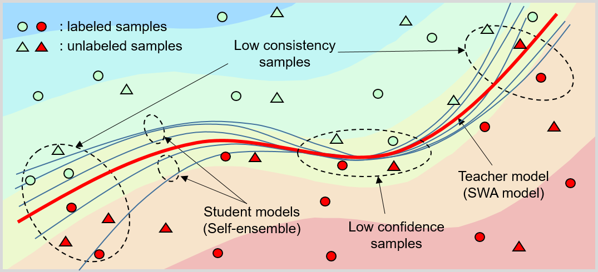

# __ST-CoNAL: Consistency-Based Acquisition Criterion Using Temporal Self-ensemble for Active Learning__ 

__*Jae Soon Baik, In Young Yoon, Jun Won Choi*__

Official implementation for [the paper](https://arxiv.org/abs/2207.02182) presented on ACCV 2022 titled "ST-CoNAL: Consistency-Based Acquisition Criterion Using Temporal Self-ensemble for Active Learning". (Pytorch implementation)


</img>

# Abstract
Modern deep learning has achieved great success in various fields. However, it requires the labeling of huge amounts of data, which is expensive and labor-intensive. Active learning (AL), which identifies the most informative samples to be labeled, is becoming increasingly important to maximize the efficiency of the training process. The existing AL methods mostly use only a single final fixed model for acquiring the samples to be labeled. This strategy may not be good enough in that the structural uncertainty of a model for given training data is not considered to acquire the samples. In this study, we propose a novel acquisition criterion based on temporal self-ensemble generated by conventional stochastic gradient descent (SGD) optimization. These self-ensemble models are obtained by capturing the intermediate network weights obtained through SGD iterations. Our acquisition function relies on a consistency measure between the student and teacher models. The student models are given a fixed number of temporal self-ensemble models, and the teacher model is constructed by averaging the weights of the student models. Using the proposed acquisition criterion, we present an AL algorithm, namely student-teacher consistency-based AL (ST-CoNAL). Experiments conducted for image classification tasks on CIFAR-10, CIFAR-100, Caltech-256, and Tiny ImageNet datasets demonstrate that the proposed ST-CoNAL achieves significantly better performance than the existing acquisition methods. Furthermore, extensive experiments show the robustness and effectiveness of our methods.

## Prerequisites:   
- Linux
- Python 3.6.9
- pytorch 1.7.1
- cuda 11.0
- numpy
- tensorboard
- torchvision

## Running code

To train the model(s) and evaluate in the paper, run this command:

```
python3 main.py -m ST-CoNAL --config ./config/cifar10/cifar10.py -m ST-CoNAL  
```
or
```
bash cifar10.sh
```

if you want to experiment about cifar_imbal. you can run this command:

```
python main.py  -m ST-CoNAL --config ./config/cifar10im/cifar10im.py -m ST-CoNAL
```

## Citation

```
@inproceedings{baik2022st,
  title={ST-CoNAL: Consistency-Based Acquisition Criterion Using Temporal Self-ensemble for Active Learning},
  author={Baik, Jae Soon and Yoon, In Young and Choi, Jun Won},
  booktitle={Proceedings of the Asian Conference on Computer Vision},
  pages={3274--3290},
  year={2022}
}
```

## Note
Our code is based on [TA-VAAL](https://github.com/cubeyoung/TA-VAAL).
